# LF-LVS: Label-Free Left Ventricular Segmentation for Transthoracic Echocardiogram (PRCV 2023)

## Introduction
This is the official code and dataset of LF-LVS: Label-Free Left Ventricular Segmentation for Transthoracic Echocardiogram, PRCV 2023.

Left ventricular segmentation for transthoracic echocardiographic (TTE) is crucial for advanced diagnosis of cardiovascular disease and measurement of cardiac function parameters. Recently, some TTE ventricular segmentation methods achieved satisfactory performance with large amounts of labeled data. However, the process of labeling medical segmentation data requires specialist surgeons and is highly time-consuming. To reduce reliance on segmentation annotations, we propose a label-free approach for left ventricular segmentation for TTE named LF-LVS. Specifically, we design multiple sets of templates and employ three common data enhancement strategies to generate pseudo-ultrasound masks and their corresponding pseudo-ground truths (pseudo-GTs). Then, we utilize CycleGAN with real-world TTE images to construct a synthetic transthoracic echocardiographic left ventricular segmentation dataset (STE-LVS), which will play an important role in the research of TTE left ventricular segmentation. Finally, we feed both the synthetic and real-world TTE data into a weight-shared segmentation network, and devise a domain adaptation discriminator to ensure their similarity in the output space of the segmentation network. Extensive experiments demonstrate the effectiveness of our proposed LF-LVS, which achieves satisfactory performance on the EchoNet-Dynamic dataset without any annotation.

## Dataset
You can get our STE-LVS dataset from [here](https://pan.baidu.com/s/1P0V74Sg0dmdN1BSqZCPTIg?pwd=0908) (Code: 0908)

## Code
Our code is being collated and will be released as soon as possible. 

## Contact
Kang Qing  
Biometrics and Intelligence Perception Lab    
College of Automation Science and Engineering  
South China University of Technology  
Wushan RD.,Tianhe District,Guangzhou,P.R.China,510641  
auqkang@mail.scut.edu.cn
